# (Semi-)Automated Reddit Video Tool with a GUI

A program that takes text input and can generate the sentence-by-sentence reading and text-to-speech stuff that's common in Reddit reading videos. Now with a GUI!

This program does not automate the entire process of making a "Reddit reading" video, because the intent is for you to take the clips it generates and add your own special flare to the video. I prefer quality over quantity so that's what this program is designed for.

## Usage

1. Obtain the comment you want to make a video for as a .txt file. Put that file in the `arvt_input_comments` folder.
1. Type in the file name in the "File Name" section. Click "Preview File" to make sure you got the right file.
1. **Click the lock icon**, then click "Split!" to have it split.
1. (Optional) If you want to have the speech and image text be different, click "Make Copy" to make a copy of it, then "Reveal in File Explorer" to find it, then edit it as you wish. Check "Use Speech Text" to enable using it.
1. Edit the image parameters as you desire. Click "Create" to see your changes.
1. Click "GO!" to make the videos!
1. Click "Reveal in File Explorer" to reveal the files' location.
1. Throw those videos into your favorite video editor and do what you want!

## System Requirements

Windows:

* OS: Windows 10 x86-64
* GPU: OpenGL 3 compatible

Linux:

* GPU: OpenGL 3 compatible

Mac OS: Not supported. Source code is right here though, so feel free to try your luck.

## Program Requirements

Note that these programs must be accessible from a plain command line, meaning they must be local to wherever this program is running or be on the system PATH.

* Python 3.8+
* ImageMagick 7 (Ubuntu: see below for issues)
* a text-to-speech program
	* Windows: Balabolka, eSpeak, [wsay (EXPERIMENTAL SUPPORT)](https://github.com/p-groarke/wsay)
	* Linux: eSpeak
* FFmpeg 4.4+ (corresponds to Ubuntu 22.04 (Jammy Jellyfish) or higher), older versions likely work but are not officially supported

### Compiling from source (Windows)

Currently only MSVC 2022 is officially supported.

1. Enable the MSVC environment variables in your command prompt: `"C:\Program Files\Microsoft Visual Studio\2022\Community\VC\Auxiliary\Build\vcvars64.bat"`
1. `cd imgui-application`
1. `build_win64.bat`
1. Executable: `"Debug/arvt-gui.exe"` (don't `cd`)

[Pre-compiled executables](https://github.com/khuiqel/automated-reddit-video-tool-gui/releases) are provided for Windows.

MSYS2 can work, but I've also tried doing these same steps and it failing. Hopefully it will work for you:

1. Prerequisites: `pacman -S mingw-w64-x86_64-gcc mingw-w64-x86_64-make mingw-w64-x86_64-glfw`
1. Open the UCRT version of MSYS2 and `cd` to wherever you put this project
1. `cd imgui-application`
1. `mingw32-make -j$(nproc)`
1. Executable: `./arvt-gui`

### Compiling from source (Linux)

Seems to work on all distributions and desktop environments. Only regularly tested on Ubuntu.

1. Prerequisites: a compiler, Make, GLFW, and pkg-config
	* Ubuntu/Mint: `sudo apt install build-essential libglfw3-dev`
	* Fedora/Bazzite: `sudo dnf install gcc-g++ make glfw-devel`
	* Arch/Manjaro: `sudo pacman -S gcc make glfw pkg-config`
1. `cd imgui-application`
1. `make -j$(nproc)`
1. Executable: `./arvt-gui`

### Ubuntu ImageMagick woes

I have spent many hours trying to get ImageMagick to work. Because I just couldn't figure out all the permission issues, this program's official requirement for ImageMagick includes [compiling it from source](https://imagemagick.org/script/install-source.php#linux) (on Ubuntu, other distros are fine). *ImageMagick's [provided AppImage](https://imagemagick.org/script/download.php#linux) will not work because it doesn't contain Pango, which is used to render the text to the image.* If you want to use Ubuntu's pre-built package, this is the best I could come up with:

* Edit `/etc/ImageMagick-<6 or 7 or whatever>/policy.xml` with the following changes:
* add: `<policy domain="coder" rights="read|write" pattern="{GIF,JPEG,PNG,WEBP,TXT}" />`
* add: `<policy domain="delegate" rights="read|write" pattern="{GIF,JPEG,PNG,WEBP,TXT}" />`
* add: `<policy domain="module" rights="read|write" pattern="{GIF,JPEG,PNG,WEBP,TXT}" />`
* add: `<policy domain="filter" rights="read|write" pattern="{GIF,JPEG,PNG,WEBP,TXT}" />`
* add: `<policy domain="coder" rights="read|write" pattern="PANGO" />` (this is supposedly the only "officially" required part)
* remove conflicting policies (mainly this: `<policy domain="path" rights="none" pattern="@*"/>` (this might be the only thing that *has* to be changed))
* In ImageMagick 6, this doesn't actually work, despite what documentation I could find saying this should be more than enough. In ImageMagick 7, the background color works just fine, but not the text color.

If you know how to get it working, please do share, because you would probably be the only person on the Internet that knows how to fix this issue. Which I find exceedingly strange no one has documented a fix for this, because if ImageMagick is truly as critical to infrastructure as [this xkcd comic claims (read the alt text)](https://xkcd.com/2347/), then it has to be running on a lot more Linux machines than Windows, so this should be a very-well documented solution. (Though those systems are probably compiling from source and thus using a security policy that works, or not using Ubuntu's security policy.)

#### Tips

Depending on your flavor of Ubuntu (such as Linux Mint), you may need to ensure you have Pango and a library for every image format you plan on using. For example, PNG and Pango would require `sudo apt install libpng-dev libpango1.0-dev` (the `-dev` version probably not necessary).

## Option list

### Foreword

Video settings: By default, this program uses H.264 and AAC codecs in an MP4 container for high compatibility, however these are not the "recommended" codecs. You will probably want lossless codecs, especially when the filesize increase is rather small. For video, I recommend changing H.264 to FFV1, or Ut Video if your video editor does not support FFV1; both require changing the container to MKV. For audio, I recommend changing AAC to FLAC, or copy if decode speed is vital.

### Execute tab

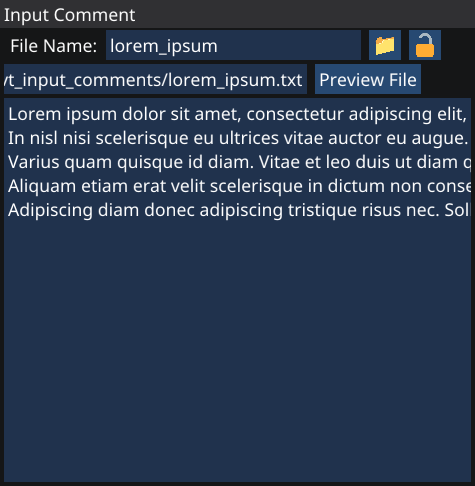

* Click the folder icon to open the folder where the comment should go.
* Click the lock icon to access the rest of the application.

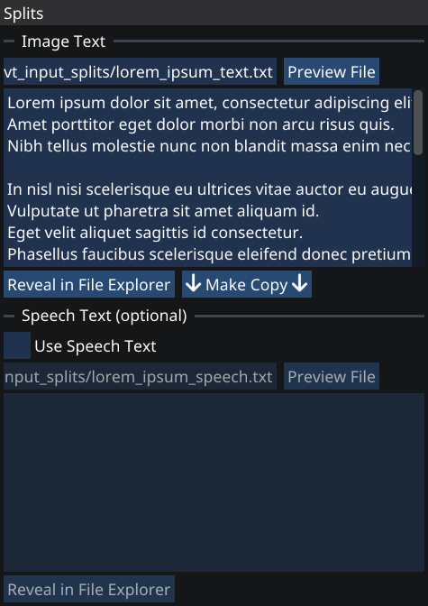

* Click "Reveal in File Explorer" to open the folder on the file. This is useful if you want to edit the text.
* "Preview File" will load the file for you to view. This will happen automatically in some cases, but if you edit the file then the changes won't show up until you click the button.
* Click "↓ Make Copy ↓" to copy the "text" file to a "speech" file. Useful for the next bullet point.
* "Use Speech Text" when you want the text on the screen to be different from the text being said. Mainly useful for when the TTS voice encounters strange symbols, or the very many things it doesn't know how to pronounce properly.

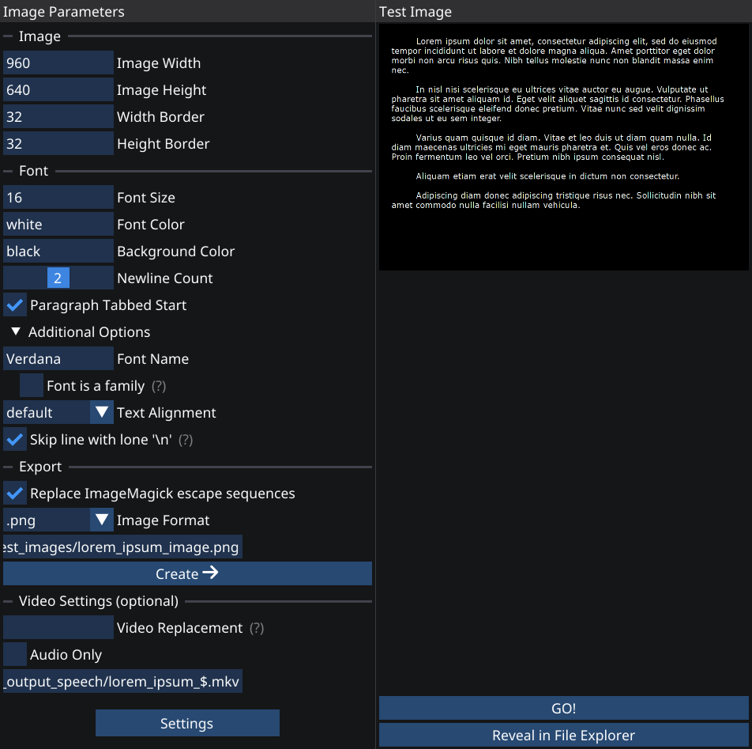

* Image and font parameters should be self-explanatory. It's probably faster for you to edit them and see what they change.
* Under "Additional Options":
	* "Font Name" changes the font used for the image/video. Some fonts are part of a font family, so you may need to enable "Font is a family". Find the supported fonts by running `magick -list font`.
	* "Skip line with lone '\n'" will create a blank line if said line only has the string "\n" on it. Useful for when you want to manually add extra newlines, for instance setting "Newline Count" to 1 and adding "\n" where you want a blank line.
* "Replace ImageMagick escape sequences" is extremely useful. ImageMagick's Pango renderer (used to render text) has an HTML-like markup language. This means `& < >` needs to be replaced by `&amp; &lt; &gt;`, otherwise it will get confused. By leaving this checked (default on), the text will be replaced in Python before sending it to ImageMagick (without modifying the file). Highly recommend you keep this on. Do note that some TTS voices will also get confused, so you may have to edit the text/speech yourself.
* "Video Replacement" is for when you only want to replace some specific videos. Useful in audio-only mode, because then you can replace just the clips needed, but in normal video mode you would also have to replace every clip after the desired one to fix the video's text.
* Click "Settings" to either write the current settings or import them. Useful for archiving your video in case you need to recreate it later.

### Configure tab

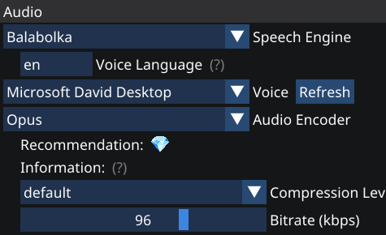

* "Speech Engine" is the program that generates the TTS speech. Windows and Linux support different speech engines.
	* "Voice Language" is for filtering the voices of the speech engine. Only supported by eSpeak.
* Each audio encoder has different options available for fine-tuning. Lossy codecs will have a bitrate slider. Some codecs have other options like compression level.
	* Audio encoders are not used in audio-only mode.

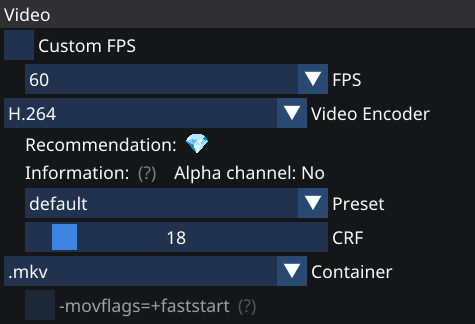

* "FPS" can use the dropdown for common values or "Custom FPS" to enter something more specific.
* Each video encoder has different options available for fine-tuning. *Most* lossy codecs will have a bitrate slider. Some codecs have other options, most of which are compression/quality levels.
* "Container" is the file format to be used for the video. `.mkv` supports everything, if you're unsure about what to pick.
	* `-movflags=+faststart` is available for some containers, such as `.mp4`. It's not necessary.
	* In audio-only mode, the container will be `.wav`.
* This whole column is not used in audio-only mode for obvious reasons.

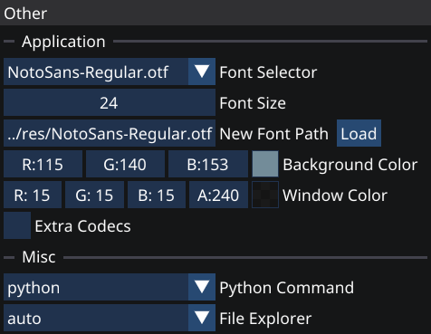

* To load a new font, enter its filepath and click "Load". To switch between loaded fonts, use "Font Selector".
* "Extra Codecs" will enable the use of the much rarer audio/video codecs. You probably won't want them.
* Change "Python Command" if you need to. Windows tends to use `python` or `py -3` while Linux tends to use `python3`.
* [Linux] "File Explorer" is the program to use when clicking "Reveal in File Explorer". `auto` will detect your system's default file manager and use that.

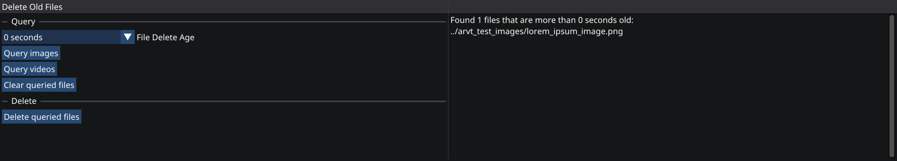

* Note that this will *permanently* delete files. But if you need to clear out old images and videos, this can be helpful. Completely optional, provided for convenience.
* "Clear queried files" will remove all the files from the deletion list. With no files in the list, nothing can get deleted.
* "Delete queried files" will delete the files. You will get one last chance to confirm, but after that the files will be deleted.

## Audio-only note

[Kdenlive](https://kdenlive.org/) seems to have trouble correctly detecting the length of the .wav files produced with audio-only mode. Simply reload/refresh the clips to fix this.

## Example usage

1. Obtaining the comment: For this example, I will be using the "GNU/Linux Interjection" copypasta. (If the `arvt_input_comments` folder doesn't exist, either create it yourself or start up the program and it will create the folder.)

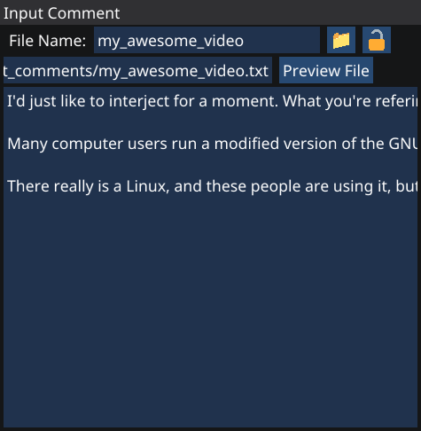

2. Split the text: This will standardize the text to one sentence per line, with extra newlines meaning a new paragraph. (Remember to click the lock icon first!)

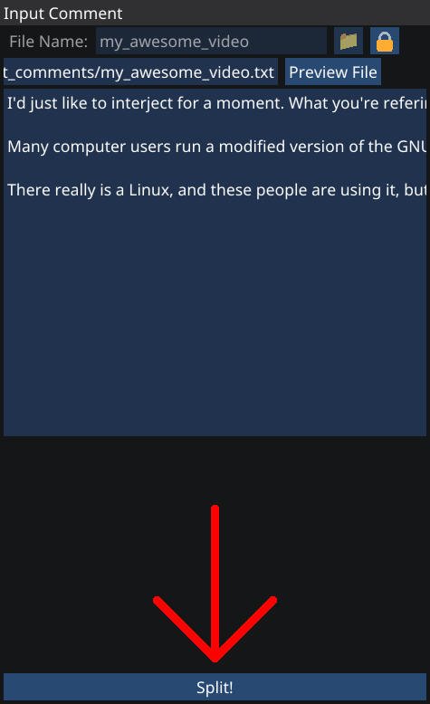
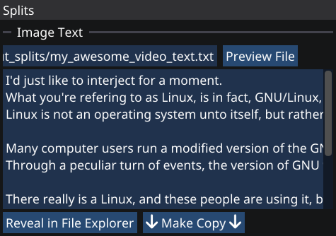

3. (Optional) Edit the splits as desired: You may want to merge sentences or add extra splits to sentences.

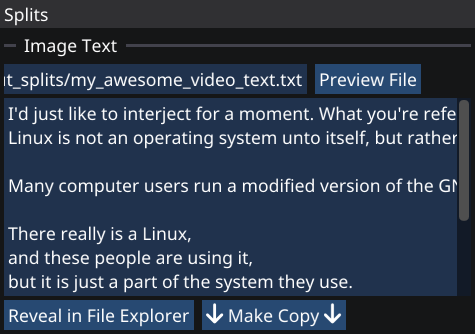

4. (Optional) Create a separate speech text file if desired: TTS voices are not a fan of text that isn't meant to be said. You can also add extra text to spice up the text on screen without harming the speech.

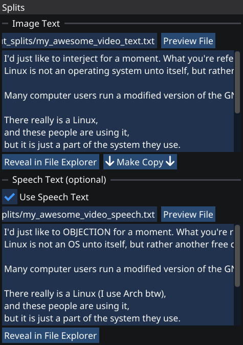

5. Edit the image parameters: This will be the video's size as well. Change to your heart's content.

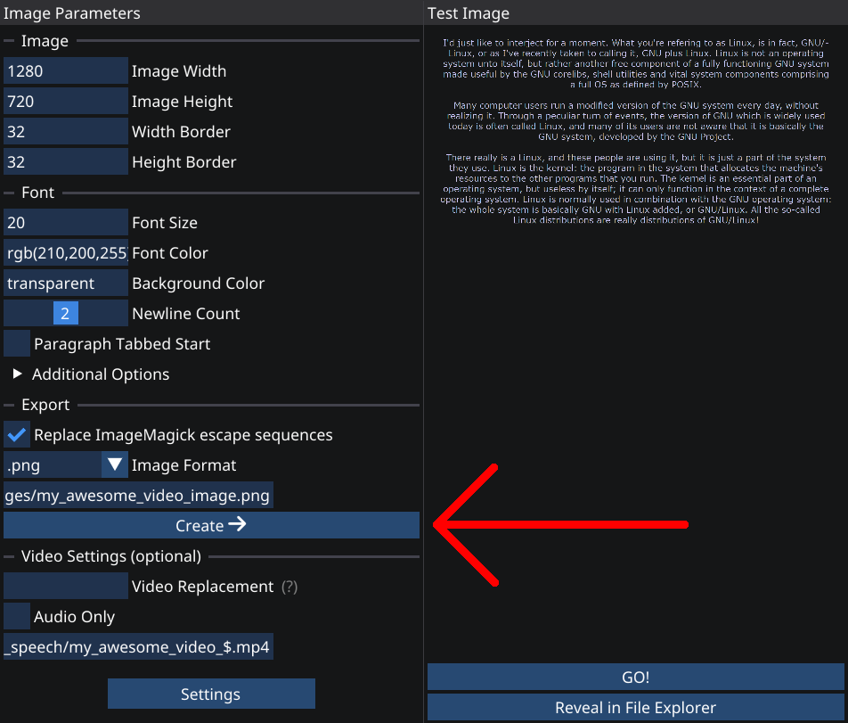
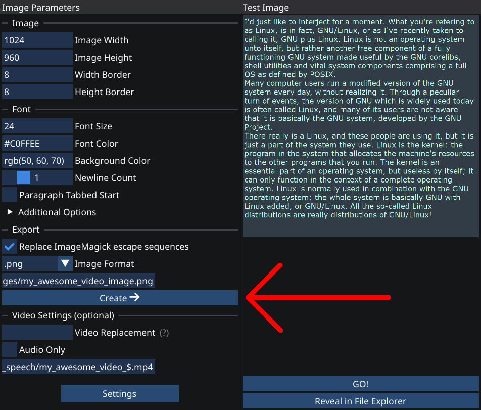

6. Make the videos

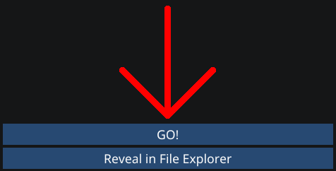

7. Create your "Reddit Reading" video: This is where you put the clips into a video editor and edit.

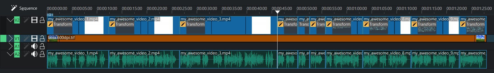

8. You're done!

## License

GNU General Public License v3.0

### Externals' licenses

* [Dear ImGui](https://github.com/ocornut/imgui): MIT
* [GLFW](https://www.glfw.org/): zlib
* [stb_image](https://github.com/nothings/stb): MIT or The Unlicense
* [mINI](https://github.com/metayeti/mINI): MIT
* [Noto Sans](https://notofonts.github.io/): [SIL OFL 1.1](https://openfontlicense.org/open-font-license-official-text/)
* [Font Awesome 6](https://fontawesome.com/): [SIL OFL 1.1](https://openfontlicense.org/open-font-license-official-text/)
* [IconFontCppHeaders](https://github.com/juliettef/IconFontCppHeaders): zlib

Emoji images in `res/` are sourced from [Emojipedia](https://emojipedia.org/), from various emoji sets. Then compressed by [Efficient Compression Tool](https://github.com/fhanau/Efficient-Compression-Tool).

## Acknowledgments

* Reddit readings
* [The Cherno](https://www.youtube.com/@TheCherno/videos) for exposing me to ImGui's ease of use
